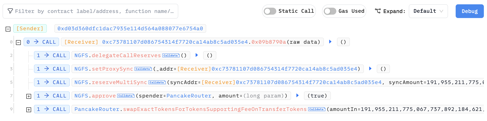
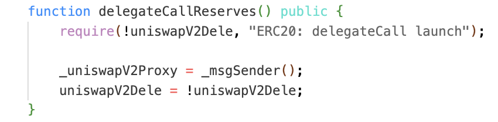
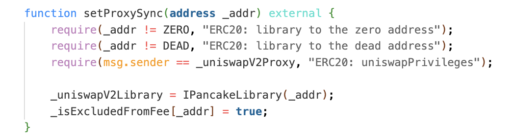

### 0x00 Summary

On April 25, 2024, NGFS Token suffered a substantial loss (~190K USD) shortly after the contract was deployed (it was deployed ~2 days ago). The primary reason for this was the inadequate access control for a crucial function, `NGFSToken::delegateCallReserves`.

### 0x01 Introduction

The victim token in the incident is `FENGSHOU (NGFS)`, and the exploitation process is straightforward - The `NGFSToken::delegateCallReserves` function lacks access control, allowing arbitrary configuration of the `_uniswapV2Proxy` variable. By leveraging this vulnerability, the attacker manipulates the `_uniswapV2Library` variable and ultimately adjusts their token balance through `NGFSToken::reserveMultiSync`.

The transaction hash is [0x8ff764dde572928c353716358e271638fa05af54be69f043df72ad9ad054de25](https://bscscan.com/tx/0x8ff764dde572928c353716358e271638fa05af54be69f043df72ad9ad054de25) on Binance Smart Chain.

The fund flow and transaction is straightforward: all funds were transferred from the NGFS token and subsequently exchanged back to the attacker’s contract via PancakeSwap.

Attacker Address: `0xd03d360dfc1dac7935e114d564a088077e6754a0`

Attacker Contract: `0xc73781107d086754314f7720ca14ab8c5ad035e4`

Victim Contract: `0xa608985f5b40cdf6862bec775207f84280a91e3a`

### 0x02 Timeline

2024-04-23 09:45:54 (UTC), the NGFS token was created

2024-04-25 11:18:05 (UTC), the attack was initiated and completed

### 0x03 Root Cause

The invocation flow is as follows, and it is not complicated:

1. The attacker initially sets the `_uniswapV2Proxy` to the attacker contract through `NGFSToken::delegateCallReserves`. Despite the expectation that this variable should be set during the deployment process, or should be set by admin, the `NGFSToken::uniswapV2Dele` value remains `false`, and there is no access control for the function, enabling the attacker to bypass the require statement.

2. Subsequently, `NGFSToken::setProxySync` is invoked. As the attacker contract is now designated as `_uniswapV2Proxy`, it can configure the `_uniswapV2Library` value to itself.

3. Finally, since the attacker contract address is also designated as the `_uniswapV2Library`, the token balance can be arbitrarily updated through `NGFSToken::reserveMultiSync`.

The attacker then swaps the tokens from NGFS token to BSC token and transfers them back to themselves.

### 0x04 Proof 0f Concept

A proof-of-concept is provided on [DeFiHackLabs](https://github.com/SunWeb3Sec/DeFiHackLabs?tab=readme-ov-file#20240425-ngfs---bad-access-control), which you can review it there.

### 0x05 Lesson Learned

Always be cautious with any critical function!

In this scenario, if the `_uniswapV2Proxy` value is meant to be set only once, developers can configure it in the constructor and marking the value as `immutable` mutability. Another mitigation strategy is to incorporate an `onlyOwner` modifier or other access control-related modifier to the function. These measures help enhance the security of the contract and mitigate the risk of unauthorized access or manipulation.

### 0x06 Reference

[1] [Certik Alert](https://x.com/CertiKAlert/status/1783476515331616847)
