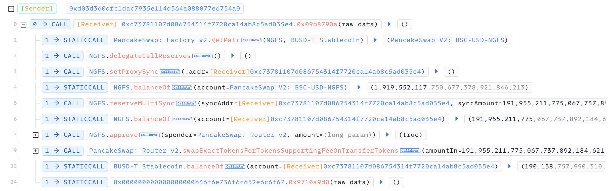
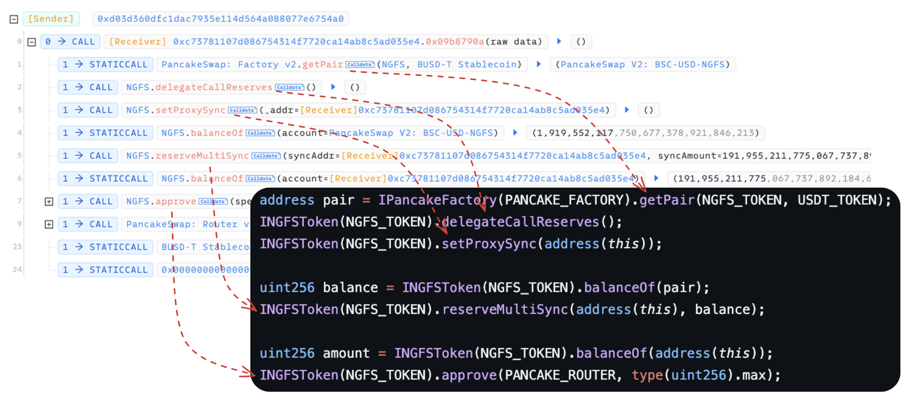
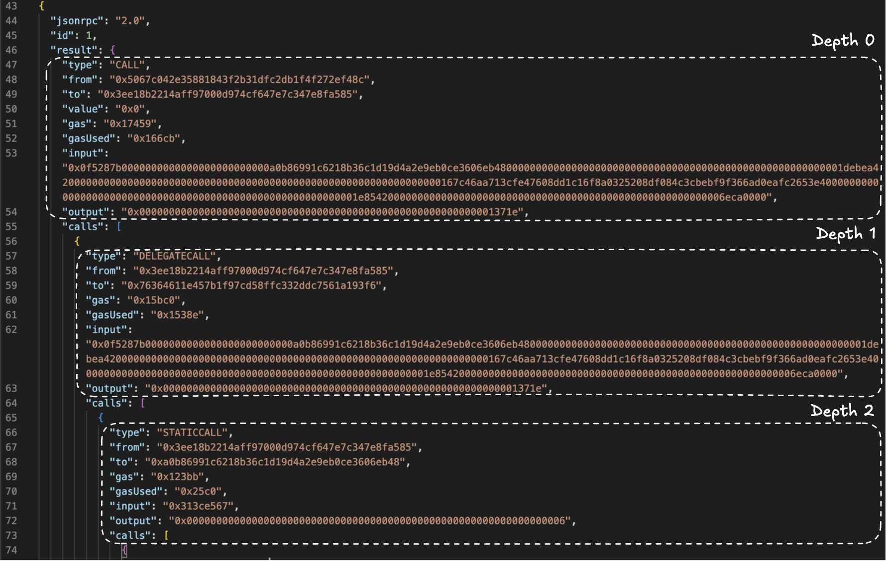
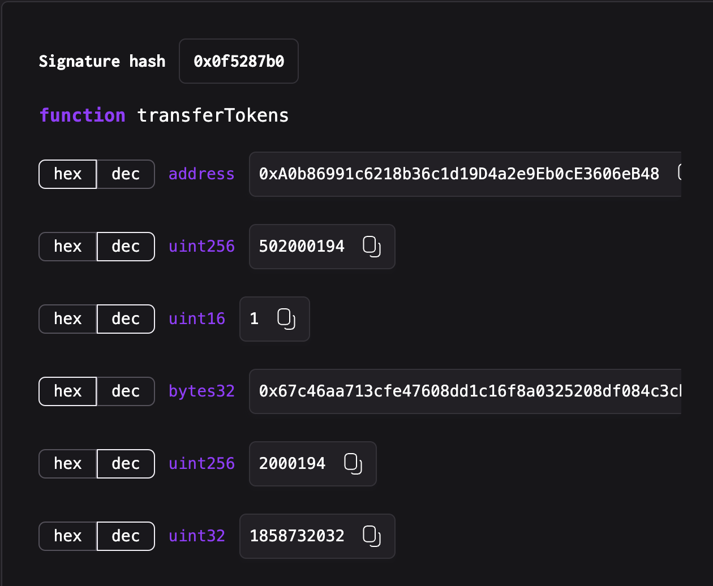
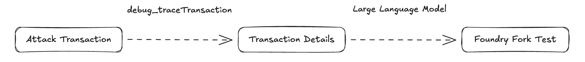

### Background

There were numerous attack incidents back in 2021 and 2022, resulting in significant losses. Upon closer examination, some of these exploits revealed a substantial time delay between the attack transaction and its detection by protocol members.

You can find how some concrete examples in DeFi Security Summit 2023: https://www.youtube.com/watch?v=jSpvDhuaCgc

With rapid development in protocol security, secure development practices have been introduced. Before deployment, protocols undergo security reviews (audits). After deployment, bug bounty programs are implemented, and monitoring systems are established to ensure quick responses to exploits. Organizations like SEAL911 and other security-focused communities have emerged to provide real-time assistance, significantly reducing the time interval between an attack and its detection.

### Problem Statement

However, identifying the root cause and analyzing from exploits is still time-consuming, especially as attack incidents become increasingly complex. Attack transactions are often intricate, making analysis challenging. While smart contract vulnerabilities such as arbitrary calls or access control issues are relatively easier to detect, DeFi-specific security issues, such as exchange rate manipulation, precision loss, or oracle manipulation, require a more in-depth examination of transaction details.

Developing proof-of-concepts (PoCs) for exploits is crucial for identifying root causes and assisting protocol teams in implementing timely mitigation measures. However, the process, also, can be tedious and time-consuming. However, based on my experience contributing to DeFiHackLabs, the largest Web3 security community known for its extensive collection of PoCs, I have observed similarities between creating PoCs and analyzing transaction invocation flows using transaction analysis tools, such as `Phalcon`, `Opchain` and more.


Take `NGFS` attack incident as example, you can find the postmortem and analysis in another post of mine, here we focus on the invocation flow of the exploit.



Based on the transaction details, the attack involves the following steps:

1. Retrieve the pair address using the PancakeSwap::getPair operation.
2. Execute the NGFS::delegateCallReserves function.
3. Invoke the NGFS::setProxySync function.
4. Call the NGFS::balanceOf function.
5. Execute the NGFS::reserveMultiSync function.
6. Perform additional operations in a similar pattern.

When compared to the ultimate proof-of-concept, the results are nearly identical.



### Proposed Solution

I further analyzed the implementation of these transaction tracer tools and identified a useful RPC method: `debug_traceTransaction`. This method attempts to replicate the execution of a transaction exactly as it occurred on the network. While exploring the Alchemy API, I discovered that the `callTracer` option tracks all call frames executed during a transaction, including those at depth 0. Additionally, the `prestateTracer` requires the prior state to execute a transaction, encompassing details such as the sender and recipient accounts, as well as the contracts invoked during execution.

The screenshot below shows a partial result of the debug_traceTransaction for the transaction hash: 0x8fc90a6c3ee3001cdcbbb685b4fbe67b1fa2bec575b15b0395fea5540d0901ae.




At depth 0, we can see that the address `0x50...8c` initiates a `CALL` to `0x3e...85`, with the following input:

```bash
0x0f5287b0000000000000000000000000a0b86991c6218b36c1d19d4a2e9eb0ce3606eb48000000000000000000000000000000000000000000000000000000001debea42000000000000000000000000000000000000000000000000000000000000000167c46aa713cfe47608dd1c16f8a0325208df084c3cbebf9f366ad0eafc2653e400000000000000000000000000000000000000000000000000000000001e8542000000000000000000000000000000000000000000000000000000006eca0000
```

This lengthy input can be decoded using tools like `abi-decoder`. Below is the decoded result obtained using Deth Tools:



It is evident that the address `0x50...8c` invokes the `transferToken` function on the contract `0x3e...85` with specific parameters.

Using this extracted information, we can create a rule to convert it into a Foundry test:

```Solidity
IContract(0x50...8c).transferTokens(0xA..48, 502000194, 1, 0x67..e4, 2000194, 1858732032);
```

The display results can be improved in the following ways:

1. For interactions with verified contracts, enhance readability by extracting additional information, such as assigning variable names to input parameters based on the analyzed source contract.
2. Detect commonly used addresses and substitute them with descriptive variables. For example, create a variable named USDC to replace occurrences of the address 0xA0b86991c6218b36c1d19D4a2e9Eb0cE3606eB48.
3. To improve feasibility and accuracy, leverage LLMs (Large Language Models) to assist in converting the extracted information into Foundry tests.

The general workflow is illustrated in the following diagram.



### Obstacles

#### Callback

One limitation of the example above is handling callback functions. When attackers initiate a flash loan for an exploit, implementing a callback function is necessary. This must be considered when writing the PoC and analyzing the transaction.

There are several scenarios where a callback function is required, such as:

1. NFT transfers: Implementing onERC721Received
2. Flash loans: Handling callbacks like executeOperation (Aave) or uniswapV2Call (UniswapV2)

In addition to implementing the callback function, ensuring the correct return value is crucial. Some functions will revert if the return value is incorrect.

#### Data Retrieval
Currently, we use the debug_traceTransaction method from the Alchemy API to extract information. While effective, it requires a paid subscription and may not be very fast. For improved efficiency, we could fetch the information directly from a node.


### Comparison

There are several existing tools, you can provide a transaction hash, and the tool will provide the proof-of-concept of the transaction.

#### Girlfriend

Link: https://github.com/fuzzland/girlfriend

This is a tool created by Fuzzland, Girlfriend (abbreviated as GF), **G**enerate **F**oundry Fork Test from Attack Transaction.

Given a transaction, the tool analyzes it and generates a Foundry fork test.

The usage is straightforward:

```bash
cargo run --bin gf -- -t 0xeaef2831d4d6bca04e4e9035613be637ae3b0034977673c1c2f10903926f29c0

# If the output_dir is `./test`, you can run it directly
forge test -vvvvv
```

This tool includes an experiment, and the results are as follows:

| Chain | Total | Success | Success Rate |
|-------|-------|---------|--------------|
| ETH   | 74    | 24      | 32.43%       |
| BSC   | 117   | 46      | 39.32%       |

**Limitation**: GF is an outstanding tool that uses a rule-based approach to recover attack transactions. I aim to enhance its accuracy to over 50% by integrating LLM for more effective recovery.

#### DeFiHackLabs Assistant

Link: https://chatgpt.com/g/g-RVmydO05a-defihacklabs-assistant

This is an LLM-based assistant, functioning as a GPT extension. Users can provide a transaction hash or the name of an attack incident, and the assistant will retrieve the corresponding Proof-of-Concept (PoC) documented in the DeFiHackLabs repository.

**Limitation:** It can only search and provide information on past attack incidents documented in the repository; it cannot analyze or provide insights on newly occurring attack incidents.


### Conclusion

DeFi exploits are becoming increasingly complex, requiring efficient and accurate methods for analyzing attack transactions and generating PoCs. While tools like Girlfriend and DeFiHackLabs Assistant offer valuable automation, their limitations call for improvement. By integrating debug_traceTransaction with LLM capabilities, we can enhance accuracy and streamline PoC generation, enabling faster and more effective incident response. This advancement supports a stronger, more secure DeFi ecosystem.
